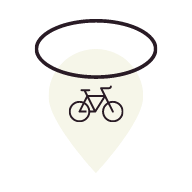

# Save Ride

    

## Sub Projects

| Path                             | Description                                                |
| -------------------------------- | ---------------------------------------------------------- |
| [server](./server/README.md)     | Node.js application to process location data               |
| [client](./frontend/README.md)   | React application to create fake clients and their routes  |
| [showcase](./showcase/README.md) | React application to visualize location data for hackathon |
